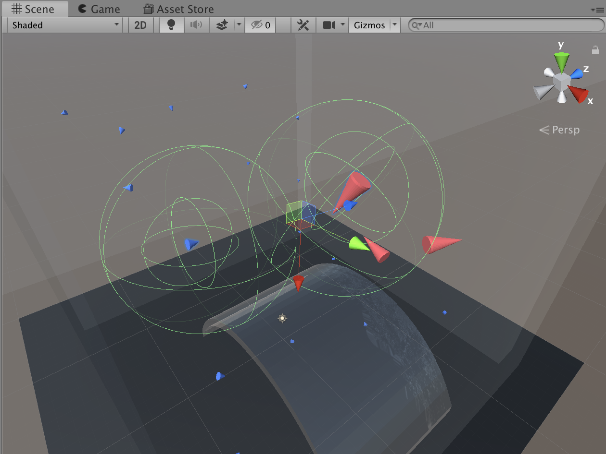

Last weekend I dedicated towards learning about swarm behaviour in animal groups. 
It all got started when I bumped into Sebastian Lague's video on boids. 
  
I was mesmerized and puzzled by behavioural patterns that can emerge in groups of primitive individuals. 
I then went ahead and watched Iain Couzin's [talk](https://www.youtube.com/watch?v=lWHYFoFRY34) 
at [Cosyne](http://www.cosyne.org) on collective behavior which has revealed some interesting observations from nature 
along with plausible reasons for swarming of various animal species from fish to baboons. 
With an intention to dive deeper into the topic I have decided to enroll into McGill Physics Hackathon and 
encouraged my friends who are familiar with Unity Engine to join me.  
From the start, I had the idea of applying Multi-Agent Reinforcement Learning (MARL) techniques to model individual 
agents and Unity `ml-agents` library was a perfect interface for that. In `ml-agents` one creates an ``Agent`` 
that interacts with the environment and endows it with a `Brain` which is the a parametrized policy that receives 
observation tuples collected by an actor and sends back an action to perform in the world. 
(If you want to learn more about ml-agents, [this](https://github.com/Unity-Technologies/ml-agents/blob/master/docs/Getting-Started-with-Balance-Ball.md) 
is the best way to start). 
Before jumping into coding, I have reviewed some literature on the topic. 
Some of the papers that I have skimmed through included [Reinforcement Learning Agents acquire Flocking and Symbiotic Behaviour in Simulated Ecosystems](https://www.mitpressjournals.org/doi/pdf/10.1162/isal_a_00148) 
from DeepMind, which suggested that we were on the right path and the swarming could emerge naturally as long 
as the incentives are aligned. In order to incentivise the boids to flock, we have introduced a `Predator` boid, 
whose goal was to hunt down the `Prey` boids. 
Following `ml-agents` interface, we set up each boid to have its own policy, keeping the representation between the 
boids within one species shared. Each boid has been given `Vision`, corresponding to the spherical region around it. 
Although this is far from the true eyesight of animals, due to hackathon's 24 hour format a sphere was good enough 
([here](https://www.earthlife.net/fish/images/anatomy/s-vision.gif) is how much fish can actually see). 
Boid agent's state space would thus consist of coordinates and velocities of the boids within the sight as well as 
types of those boids -- 0 for self, 1 for kin and 2 for other spicies type. 
In order to determine rewards, we have constructed another sphere around the boid which we called 'predation' region. 
This region was instrumental to determining rewards of the agents. 
If the predation region of `Prey` and `Predator` boids would interect, a reward of -1 and 1 would be given respectively. 
Since we have decided to avoid an expicit incetive for swarming, the reward in all other cases was left at 0. 
Below is an illustration of boids' vision and predation regions. 
 

Apparently, we got nominated for the top 3 in the hackathon, but everyone was so sleep deprived that we just left home, before judging sessions.

