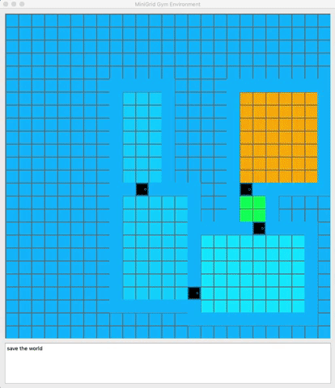

I am a final year undergraduate at Concordia University, Montreal studying Mathematics and Statistics.
My research is focused around acquisition of meaningful abstraction via Reinforcement Learning. I am particularly curious about integrating temporal abstraction in autonomous agents, so that they can learn and plan at multiple levels of hierarchy at the same time.
I also think about immediate applications of RL to tackle problems like [climate change](https://github.com/konichuvak/hotrl).
Outside of research, I enjoy chess, [rock climbing](https://photos.google.com/share/AF1QipMuv_53KYDaQAUiO5VjdN5d3okVLel7uD6aSBTjP0QKOjCvY-s7Ax_cH87ZtG28_A?key=SmJkVlk2TUwyVlZIbnR2bTdlV0tqeExBOERLaThB), and [hiking](https://photos.google.com/share/AF1QipNAjoFmZcTkeP0KuT2eM4nnvdpAt8FyP9yuHC852i3Nj-JXZ8ZDwZAjGiuWvQXlQA?key=M0JKekJFNC1COU1oenRjZTd0dUl2VUxwUkdtWEt3).

## Projects 

| :-------------------------------------: |:-------------:| -----:|
|  | Collection of implementations for Hierarchical Reinforcement Learning algorithms | [[code](https://github.com/konichuvak/hrl)] |
| [insert gif here] | Interactive follow-along for [Reinforcement Learning: An Introduction](http://www.incompleteideas.net/book/the-book-2nd.html) book | [[code](https://github.com/konichuvak/rl_experiments)] |
|  | It's getting hot in here: applying RL techniques to develop a cost efficient thermostat for household heating. Project was submitted for [2019 Climate Change Hacakathon](https://launchlab.ai/hackathon/). | [[code](https://github.com/konichuvak/hotrl), [devpost](https://devpost.com/software/it-s-getting-hot-in-here)  |
|  | Space-XY: winning project of [ImplementAI 2019](http://www.implementai.com) hackathon inspired by Space-X reusable rockets and OpenAI [LunarLander](https://gym.openai.com/envs/LunarLander-v2) environment for RL agents | [[website](https://sites.google.com/view/space-xy), [devpost](https://devpost.com/software/lunarlander-v2)  |
|   | A jupyter notebook containing my solutions to [Project Euler](https://projecteuler.net)  | [[code](https://github.com/konichuvak/project_euler)]

